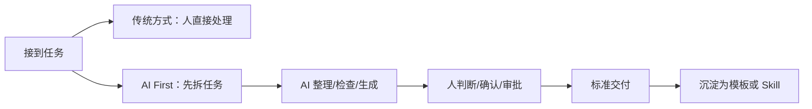
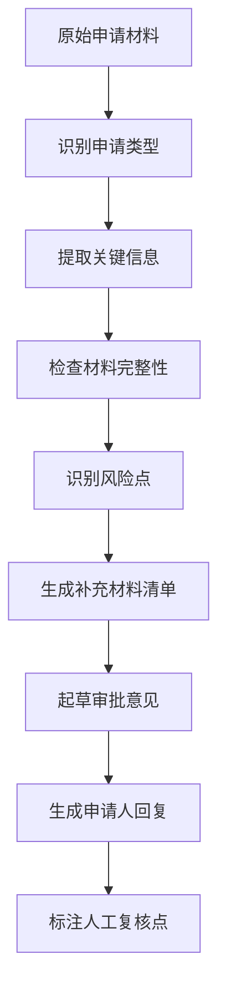

# AI First 行政思维转型：从事务执行到智能协同

> **课程时长**: 90 分钟 | **对象**: 集团行政部门 | **形式**: 讲解 + 场景拆解 + 本地 AI Skill 实操

---

## 本课概览

```text
┌──────────────────────────────────────────────────────────────┐
│ 核心观点                                                     │
│ AI First 不是“先找一个 AI 工具”，而是先重新设计任务流程。      │
├──────────────────────────────────────────────────────────────┤
│ 你将学到                                                     │
│ 1. 行政工作为什么需要 AI First 思维                           │
│ 2. 如何把高频行政任务拆成 AI 可参与的流程                      │
│ 3. 如何用本地 AI Skill 完成一次行政审批预审                    │
│ 4. 哪些事情必须由人判断，不能交给 AI 做最终决定                │
└──────────────────────────────────────────────────────────────┘
```

今天这门课不是工具清单，也不是“让 AI 替代行政人员”。

我们要讨论的是：当 AI 已经可以理解文本、整理信息、检查材料、生成回复时，行政工作应该怎样重新组织？哪些任务可以被标准化？哪些判断必须保留在人手里？一个行政人员如何把自己的经验，变成可复用的 AI 工作流？

---

## Opening Hook（10分钟）

### 一个熟悉的早晨

早上 9 点，行政同事打开消息和邮件，可能同时看到这些事情：

- 有员工问电脑申请流程怎么走。
- 有部门催资产调拨进度。
- 有人提交电脑报废回购申请，但材料不完整。
- 餐费结算表里有几个部门和成本中心对不上。
- 领导临时要一份本周行政事项进展汇总。

这些工作看起来不同，但底层动作很像：

1. 读一段不完整的信息。
2. 判断它属于什么流程。
3. 检查缺了什么材料。
4. 找出风险或不一致。
5. 写一段标准回复。
6. 再提醒对方下一步怎么做。

过去这些动作依赖人的经验和耐心。AI First 的问题是：

> 这些动作里，哪些可以让 AI 先做一遍？

### 今天的核心转变



传统方式强调“我把事情做完”。AI First 强调“我把流程设计好，让 AI 先完成可重复部分，人负责关键判断”。

本课的目标不是让大家会用一个新按钮，而是带走一种工作方法：以后遇到重复任务时，可以先问自己：这件事能不能变成一个 AI 工作流？

---

## Section 1：从事务执行到流程设计（20分钟）

### 1.1 AI First 不是工具优先，而是流程优先

很多人第一次接触 AI，会这样提问：

```text
帮我写一个通知。
帮我总结一下。
帮我做个表。
```

这些当然能提效，但这仍然是“单点使用 AI”。AI First 更进一步，它会问：

```text
这项工作稳定重复吗？
输入材料通常是什么？
AI 可以先做哪些检查？
输出有没有固定格式？
哪些地方必须由人确认？
```

这就是行政工作的转型点：从“事务执行者”升级为“流程设计者”。

### 1.2 行政 AI First 四问

| 问题 | 作用 | 行政例子 |
|---|---|---|
| 目标是什么？ | 防止 AI 只生成文字，不解决任务 | 不是写回复，而是推进审批材料补齐 |
| 输入是什么？ | 明确 AI 能看到哪些信息 | 申请表、邮件、聊天记录、Excel、制度片段 |
| 标准是什么？ | 让 AI 按规则检查 | 必填字段、审批条件、附件要求、风险边界 |
| 人负责什么？ | 防止 AI 越权 | 最终审批、价格确认、系统状态核验、例外判断 |

这四问可以用于大多数行政工作。

例如“电脑报废回购申请”，如果只是让 AI 写审批意见，价值有限；如果让 AI 按流程预审材料，就会产生更稳定的价值。

### 1.3 从“帮我写”到“帮我跑流程”

低质量提问：

```text
帮我写个审批意见。
```

AI First 提问：

```text
请对下面的电脑报废回购申请做预审。
要求：
1. 先判断申请类型；
2. 提取关键信息；
3. 检查必填材料是否缺失；
4. 标注风险点；
5. 生成补充材料清单；
6. 起草审批意见和给申请人的回复；
7. 明确哪些地方必须人工确认；
8. 不替代审批人做最终决定。
```

这两种提问的差异，就是思维模式的差异。

### 1.4 行政人员的新能力

AI First 对行政人员提出的新能力，不是写代码，而是：

- 把经验说清楚。
- 把流程拆明白。
- 把标准写出来。
- 把边界划清楚。
- 把好用的流程沉淀下来。

这也是为什么本课后半段会用 Skill 做实操。Skill 的本质不是复杂系统，而是一套可复用的任务流程。

---

## Section 2：行政高频场景的 AI First 拆解（20分钟）

### 2.1 哪些行政任务最适合 AI 先做

从实际收集到的场景看，行政部门的 AI 提效需求集中在这些方向：

| 场景 | 高频动作 | AI 适合做什么 | 人必须做什么 |
|---|---|---|---|
| 流程审批 | 材料检查、意见起草 | 完整性检查、风险提示、回复草稿 | 审批决定、例外判断 |
| 资产调拨 | 表格录入、信息同步 | 字段提取、缺失检查、邮件草稿 | 系统操作、资产状态确认 |
| 费用/餐费结算 | 数据清洗、分摊统计 | 异常识别、口径说明、汇总摘要 | 金额确认、财务入账 |
| 员工答疑 | 流程咨询、材料说明 | FAQ 整理、标准回复 | 个人数据查询、特殊情况处理 |
| 食材验收 | 清单记录、异常沟通 | 验收清单、异常记录模板 | 现场质量判断、供应商确认 |

### 2.2 适合本地 AI Skill 的任务特征

不是所有任务都适合在课堂上做完整实操。适合本地 AI Skill 的任务通常有四个特征：

1. **输入可以脱敏**：不用真实系统权限。
2. **流程可以描述**：有明确步骤和输出格式。
3. **风险可以标注**：AI 能提醒，但不做最终决定。
4. **结果能现场验证**：学员一眼看出比手工更清晰。

因此，本课选择“行政审批预审”作为主实操，而不是员工答疑系统。

员工答疑助手很有价值，但完整落地往往需要知识库、权限、员工身份、系统查询能力。对 90 分钟培训来说，容易变成系统建设讨论。

审批预审更适合课堂：不接 OA，不接 SAP，不用真实数据，只用一段模拟材料，就能跑完整流程。

### 2.3 任务拆解模板

以后看到一个行政任务，可以用这个模板判断是否适合 AI First：

```text
任务名称：
输入材料：
重复频率：
当前耗时：
AI 可处理环节：
人工判断环节：
输出格式：
风险边界：
是否可沉淀为模板/Skill：
```

示例：

| 项目 | 内容 |
|---|---|
| 任务名称 | 电脑报废回购申请预审 |
| 输入材料 | 申请人、部门、资产编号、原因、附件说明 |
| 重复频率 | 每周或每月重复出现 |
| AI 可处理环节 | 信息提取、缺失检查、风险提示、话术草稿 |
| 人工判断环节 | 是否符合制度、资产状态、价格确认、最终审批 |
| 输出格式 | 预审表 + 补充材料清单 + 回复话术 |
| 风险边界 | 不编造制度，不替代审批，不查询真实系统 |

---

## Section 3：实操：行政审批预审 Skill（25分钟）

### 3.1 今天要跑通的完整流程

实操目标：用本地 AI Skill 完成一次“电脑报废回购申请”的预审。

流程如下：



这个流程的重点是：AI 先做预审，人再做判断。

### 3.2 原始材料

```text
申请人：张三
部门：市场部
事项：申请电脑报废回购
资产编号：IT-2021-0866
设备名称：ThinkPad 笔记本电脑
购置时间：2021年5月
当前使用人：张三
申请原因：设备老旧，运行卡顿，希望按公司政策回购
成本中心：未填写
附件：资产照片1张，未提供检测证明
期望处理时间：本周五前

补充说明：
- 申请人表示电脑仍可开机，但运行较慢。
- 未提供资产系统状态截图。
- 未说明是否完成数据备份和数据清除。
```

这段材料的问题很典型：不是完全没有信息，而是信息不够完整，缺少几个关键确认点。

### 3.3 运行 Skill 的提示词

```text
Use $admin-approval-preflight to review this administrative request.

请输出：
1. 申请摘要
2. 材料完整性检查
3. 风险点
4. 需补充事项
5. 审批意见草稿
6. 给申请人的回复话术
7. 必须人工复核的点

申请材料：
[粘贴上面的申请材料]
```

### 3.4 预期输出片段

| 检查项 | 状态 | 说明 |
|---|---|---|
| 申请人、部门、当前使用人 | 已提供 | 申请人与当前使用人均为张三，部门为市场部 |
| 资产编号和设备名称 | 已提供 | 已提供资产编号 IT-2021-0866 和设备名称 |
| 成本中心 | 缺失 | 当前为未填写 |
| 检测证明 | 缺失 | 仅有资产照片，未提供检测结论 |
| 数据清除说明 | 缺失 | 未说明是否完成信息安全处理 |
| 回购政策或价格依据 | 缺失 | 未提供政策依据、估值或价格信息 |

风险点示例：

| 风险点 | 风险等级 | 建议处理 |
|---|---|---|
| 未确认资产系统状态 | 高 | 在资产系统核验资产编号、当前使用人和状态 |
| 未说明数据清除 | 高 | 确认数据备份、数据清除和安全合规步骤 |
| 回购政策依据缺失 | 中 | 补充制度依据、估值或价格确认方式 |

### 3.5 这不是审批，而是预审

AI 输出的审批意见应该是这样的：

> 该申请已提供申请人、部门、资产编号、设备名称、购置时间和申请原因等基础信息，但当前缺少设备检测证明、资产系统状态确认、成本中心、数据清除说明及回购政策/价格依据。建议申请人补充上述材料后，再提交正式审批。最终是否符合报废回购条件，需由资产管理及相关审批人根据公司制度和系统记录确认。

注意这里的边界：AI 没有说“同意回购”，也没有说“价格是多少”，更没有声称已经查过系统。AI 不做最终审批，只做预审和提醒。

### 3.6 现场练习

请任选一个变量修改原始材料，然后重新运行 Skill：

- 删除资产编号。
- 把当前使用人改成李四。
- 把期望处理时间改成“今天下班前”。
- 增加“已提供检测证明”。
- 增加“成本中心：MKT-2026”。

观察 AI 输出如何变化。真正有价值的 Skill，不是只会回答一个固定样例，而是能在同类任务里稳定执行相同流程。

---

## Section 4：风险边界与人机分工（10分钟）

### 4.1 AI 可以做什么

| AI 可以做 | 价值 |
|---|---|
| 信息提取 | 把散乱材料整理成结构化摘要 |
| 完整性检查 | 找出缺失字段和附件 |
| 一致性检查 | 发现当前使用人、成本中心、时间等冲突 |
| 风险提示 | 提醒制度、系统、信息安全等复核点 |
| 文案起草 | 生成审批意见、补充材料通知、邮件回复 |
| 模板沉淀 | 把经验变成可复用流程 |

### 4.2 AI 不应该做什么

| AI 不应该做 | 原因 |
|---|---|
| 最终审批决定 | 需要组织授权和责任承担 |
| 编造制度依据 | 制度必须来自真实文件 |
| 声称完成系统查询 | AI 没有接入系统时不能假装查过 |
| 判断真实资产状态 | 需要资产系统或现场确认 |
| 给出回购价格 | 涉及政策、财务和审批 |
| 暴露敏感个人信息 | 需要遵守隐私和数据安全要求 |

### 4.3 行政 AI First 的安全句式

建议在所有行政类 Skill 里加入这些边界：

```text
不要替代审批人做最终决定。
不要编造制度、价格、系统状态或员工个人数据。
如果信息缺失，请明确标注“缺失”或“需人工确认”。
涉及 OA/SAP/资产系统的数据，只能提示需要查询，不能声称已经查询。
输出必须包含人工复核点。
```

这些句式看起来简单，但非常重要。它们能把 AI 从“看似聪明的回答者”，变成“可靠的预审助手”。

---

## Closing（5分钟）

### 今天带走的三件事

1. **AI First 是流程思维**：不是先找工具，而是先重构任务。
2. **行政工作很适合 Skill 化**：尤其是材料检查、数据整理、标准回复、流程预审。
3. **人机分工必须清楚**：AI 做整理和预审，人做判断和审批。

### 课后行动清单

本周可以马上做三件事：

- 选一个每周重复 3 次以上的行政任务。
- 用“任务拆解模板”写清输入、标准、输出和人工判断点。
- 把它改造成一条可复用提示词或本地 Skill。

### 最后一页


行政部门的 AI First 转型，不是从一个大系统开始，而是从一个高频任务开始。

先让 AI 把可重复部分做稳，再让人把关键判断做准。
