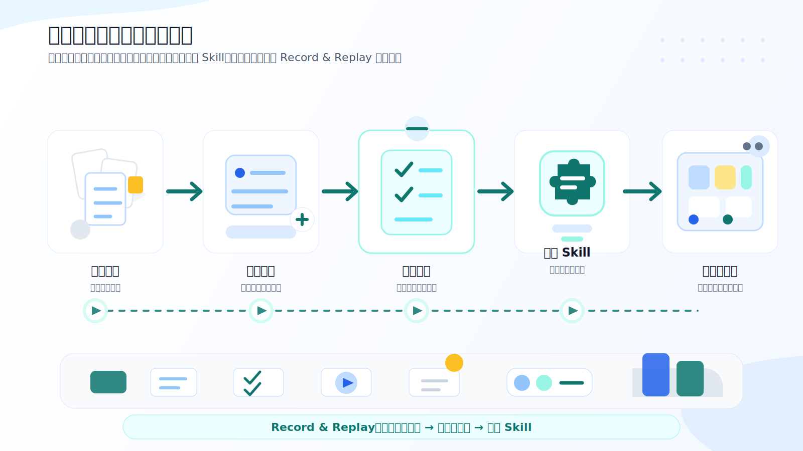

# AI First 行政思维转型专题课

> 面向集团行政部门的 90 分钟 AI First 思考模式转型培训材料

## 课程定位

**不是教“有哪些 AI 工具”，而是教“行政工作如何先用 AI First 方式重新组织任务流程”。**

这门专题课帮助行政团队从“接到任务后手工执行”，转向“先判断哪些环节适合 AI 参与、哪些判断必须由人负责、如何把重复任务沉淀成可复用工作流”。

- **受众**：集团行政、综合管理、资产管理、后勤、费用结算、流程支持等职能团队
- **时长**：90 分钟
- **形式**：讲解 + 场景拆解 + 本地 AI Skill 实操
- **主实操**：行政审批预审助手
- **扩展能力**：Codex Record & Replay 脱敏演示复盘
- **发布站点**：[GitHub Pages](https://aicode-nexus.github.io/ai-first-administration/)

## 学习入口

| 入口 | 说明 |
|---|---|
| [课程学习中心](demo/src/app/learn/) | Next.js 静态课程站源码 |
| [专题课讲义](AI-First行政思维转型/final-content.md) | 完整 90 分钟讲义 |
| [实操案例](实操案例/行政审批预审/) | 行政审批预审演示材料，含 Record & Replay 扩展 |
| [配套 Skill](skills/admin-approval-preflight/) | 本地 AI 预审工作流 |

## 90 分钟课程结构

| 模块 | 时长 | 目标 |
|---|---:|---|
| Opening Hook | 10 分钟 | 建立行政工作为什么需要 AI First 的共识 |
| Section 1：思维转型 | 20 分钟 | 从事务执行转向流程设计 |
| Section 2：场景拆解 | 20 分钟 | 识别适合 AI 的行政高频任务 |
| Section 3：本地 Skill 工作流 | 25 分钟 | 跑通行政审批预审完整任务流程 |
| Section 4：边界与风控 | 10 分钟 | 明确人机分工、数据与审批边界 |
| Closing | 5 分钟 | 形成部门落地行动清单 |

## 核心观点



## 快速开始

```bash
cd demo
pnpm install --no-frozen-lockfile
pnpm dev
```

访问：`http://localhost:3000/learn`

## 本地 Skill 调用示例

```text
Use $admin-approval-preflight to review this administrative request.

[粘贴行政申请材料]
```

## 文件结构

```text
.
├── README.md
├── 课程设计文档.md
├── 课程格式规范.md
├── AI-First行政思维转型/
│   └── final-content.md
├── 实操案例/
│   └── 行政审批预审/
├── skills/
│   └── admin-approval-preflight/
└── demo/
    └── Next.js 静态课程站
```
